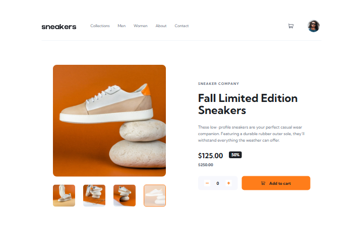

# Frontend Mentor - E-commerce product page solution

This is a solution to the [E-commerce product page challenge on Frontend Mentor](https://www.frontendmentor.io/challenges/ecommerce-product-page-UPsZ9MJp6). Frontend Mentor challenges help you improve your coding skills by building realistic projects.

## Table of contents

- [Overview](#overview)
  - [The challenge](#the-challenge)
  - [Screenshot](#screenshot)
  - [Links](#links)
- [My process](#my-process)
  - [Built with](#built-with)
  - [What I learned](#what-i-learned)
  - [Continued development](#continued-development)
  - [AI Collaboration](#ai-collaboration)
- [Author](#author)

## Overview

### The challenge

Users should be able to:

- View the optimal layout for the site depending on their device's screen size
- See hover states for all interactive elements on the page
- Open a lightbox gallery by clicking on the large product image
- Switch the large product image by clicking on the small thumbnail images
- Add items to the cart
- View the cart and remove items from it

### Screenshot



### Links

- Solution URL: [Github page](https://github.com/artemkotko14/ecommerce-product-page)
- Live Site URL: [Webpage](https://artemkotko14.github.io/ecommerce-product-page/)

## My process

### Built with

- Semantic HTML5 markup
- Flexbox
- Mobile-first workflow
- SASS

### What I learned

Changing color of svg img:

```css
filter: brightness(0) saturate(100%) invert(12%) sepia(8%) saturate(761%)
  hue-rotate(178deg) brightness(95%) contrast(93%);
```

To central element vertically:

```css
position: absolute;
top: 50%;
transform: translateY(-50%);
```

I've learnt how to make a carousel:

```js
let carouselTimer;

function startCarousel() {
  clearInterval(carouselTimer);
  carouselTimer = setInterval(() => {
    changeImage(1);
  }, 6000);
}
```

I also learned how to reload page with JS:

```js
location.reload();
```

### Continued development

I would like to continue improving the accessibility and responsiveness of the page, especially keyboard navigation and focus states. I also want to improve my JavaScript skills by making the carousel, lightbox, and shopping cart functionality more robust and reusable. In the future, I would also like to rebuild the project using React to practice component-based development and state management.

### AI Collaboration

I used ChatGPT for debugging and understanding my code during the challenge. I asked for help when I had problems with HTML, SCSS, JavaScript, responsive design, and accessibility, and used it to understand why certain parts of my code were not working as expected. I also asked questions about concepts such as lightboxes, event listeners, focus states, CSS positioning, and responsive breakpoints. I mainly used ChatGPT as a learning and debugging tool while keeping the main structure and implementation of my project my own.

## Author

- Github - [Artem Kotko](https://github.com/artemkotko14)
- Frontend Mentor - [@artemkotko14](https://www.frontendmentor.io/profile/artemkotko14)
